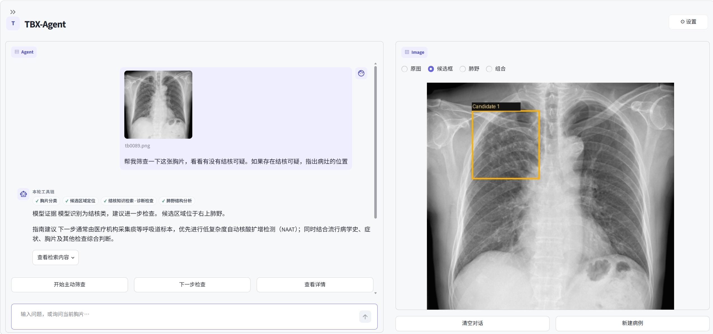
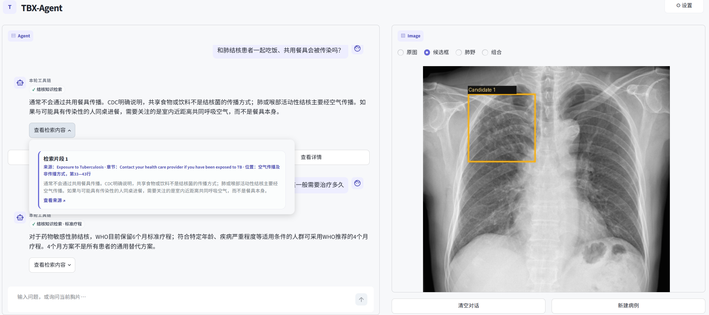
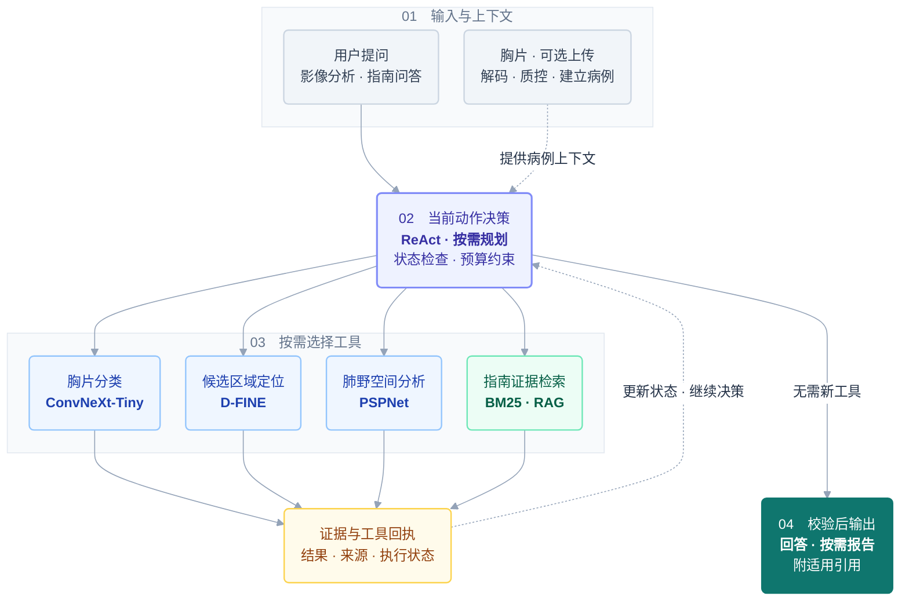

<div align="center">

# TBX-Agent

**面向胸片分析与指南问答的本地智能体**

本地部署的胸部 X 线分析研究原型 · 仅推理发布版


[项目展示](#项目展示) · [核心能力](#核心能力) · [视觉模型性能](#视觉模型性能) · [测试结果](#测试结果) · [使用真实模型](#使用真实模型)

</div>

TBX-Agent 将胸片分类、候选区域定位、肺野分割和指南检索接入同一条对话流程。
用户提出问题后，Agent 根据当前病例与工具结果选择下一步动作，按需调用模型或复用已有证据，
再组合影像结果和带来源的指南回答。
项目提供 **Streamlit 可视化界面**与 **FastAPI 接口**，支持在本机部署模型与保存病例记录。

## 项目展示

**胸片分析与候选区域可视化**：通过自然语言发起分类、定位及肺野空间分析，右侧查看检测框。



**带引用的指南问答**：连续追问时按当前问题检索，并展开查看证据片段及来源。



## 核心能力

| 能力 | 方法 | 使用效果 |
| --- | --- | --- |
| 胸片分类 | ConvNeXt-Tiny | 展示胸片三分类结果 |
| 候选区域定位 | D-FINE | 标出候选区域，辅助查看影像中的局部信息 |
| 肺野空间分析 | PSPNet | 分割左右肺，描述上、中、下二维区域 |
| 指南问答 | BM25 / 可选 Dense、Hybrid RAG | 检索指南证据，提供可追溯引用 |
| 任务编排 | ReAct + 按需规划 | 根据问题和最新结果选择动作，复杂任务登记计划，失败时有界恢复 |
| 对话与记录 | MedGemma + 本地病例管理 | 组织文本回答，支持问卷、病例记录与报告 |

默认语言层为 **MedGemma 1.5 4B Q4_K_M + llama.cpp**，基于专用工具产生的文本证据组织回答。
视觉分析由用户问题触发，上传时完成影像解码、质量检查与病例建立。

## 视觉模型性能

在 **coda 平台**的 **TBX11K 官方测试集**评测中，本项目视觉模型的类别无关检测（合并结核子类）取得 **AP50 71.11、AP75 30.58、AP@[0.50:0.95] 35.38**，较所对照的历史榜单最佳值分别提升 **9.37、10.94、8.06 个百分点**，在严格定位评价和综合 AP 上表现突出。分类 **Accuracy 为 91.31%、AUC 为 97.11%**。

## 工作流程



Agent 每步最多调用一个工具，根据返回结果决定继续分析还是回答；已有信息足够时可以直接回答，
信息不足时明确说明缺口。

## 测试结果

测试分为软件契约与真实模型对话两层。分类、检测的独立数据集指标见上方“视觉模型性能”。

| 验证范围 | 结果 |
| --- | --- |
| 发布版软件回归 | **1344 通过、2 跳过**；覆盖 API、病例隔离、工具依赖、缓存、失败恢复和引用 |
| 真实本地 LLM 对话回归 | **62 轮**合成视觉场景；工具序列 **58/62**、工具与关键文字联合检查 **54/62** |
| 实现冻结后独立新增问法 | 上述 62 轮中的 **12 轮自动检查全部通过** |

对话评测使用真实本地 MedGemma、合成视觉结果与本地 RAG；覆盖范围与复现命令见[测试说明](docs/evaluation.md)。

## 使用真实模型

准备 **Python 3.11–3.13、Git** 和可联网的安装环境。本仓库仅提供推理代码，
模型权重单独下载，无需训练或准备数据集。

| 模型 | 用途 | 获取方式 |
| --- | --- | --- |
| ConvNeXt-Tiny + D-FINE | 分类与候选定位 | 从 [Release](https://github.com/fusq-zt/tbx-agent/releases/tag/v0.1.0) 下载 `tbx-rank03-inference-v1.zip` |
| PSPNet | 肺野分割 | 下方脚本从 TorchXRayVision 下载 |
| MedGemma 1.5 4B | 对话与回答组织 | 下方脚本下载 GGUF 并准备 llama.cpp |

当前仓库和 Release 为私有，请先登录已获访问权限的 GitHub 账号。

### 1. 获取项目

```bash
git clone https://github.com/fusq-zt/tbx-agent.git
cd tbx-agent
```

### 2. 安装环境与模型

下面是 **Windows x64 / PowerShell 首次部署**的完整步骤。
Linux 请参考[视觉模型部署](docs/deployment/inference_models.md)与
[llama.cpp 构建说明](docs/deployment/medgemma_runtime.md#linux)。

先下载上表的视觉 ZIP，无需手动解压；在项目目录执行：

```powershell
# 模型与运行数据存放在源码目录外
$tbxRoot = Join-Path $env:LOCALAPPDATA 'TBX-Agent'
$env:TBX_ARTIFACT_ROOT = Join-Path $tbxRoot 'artifacts'
$env:TBX_RUNTIME_ROOT = Join-Path $tbxRoot 'runtime'
$env:TBX_AGENT_DATA_ROOT = $env:TBX_RUNTIME_ROOT
$env:TBX_AGENT_RANK03_RUNTIME_CONFIG = Join-Path $env:TBX_RUNTIME_ROOT 'config\rank03_runtime.json'
$visionBundle = Read-Host '已下载的视觉 ZIP 完整路径'

# 创建虚拟环境、安装依赖和分类 / 检测权重
& .\scripts\bootstrap.ps1 -Extras 'ui,dicom,vision,anatomy' `
  -VisionBundle $visionBundle `
  -CacheDir $env:TBX_ARTIFACT_ROOT `
  -RuntimeConfig $env:TBX_AGENT_RANK03_RUNTIME_CONFIG

# 准备检测推理源码与肺野分割模型
& .\.venv\Scripts\python.exe scripts\bootstrap_dfine.py --cache-dir $env:TBX_ARTIFACT_ROOT
& .\.venv\Scripts\python.exe scripts\bootstrap_models.py --cache-dir $env:TBX_ARTIFACT_ROOT download anatomy

# 准备 MedGemma 与本地 llama.cpp 服务
& .\.venv\Scripts\python.exe scripts\setup_medgemma.py --download --runtime-root $env:TBX_RUNTIME_ROOT
```

使用模型前需遵守上游条款；访问设置与已有 GGUF 的使用方式见[语言模型部署](docs/deployment/medgemma_runtime.md)。
如自定义存放目录，请将对应路径写入本地 `.env`，便于后续启动。

### 3. 启动应用

```powershell
& .\scripts\run_local.ps1
```

启动器会检查模型并管理本地服务。打开 **[交互界面](http://127.0.0.1:8501)**，
即可上传胸片、发起分析或进行指南问答；接口说明位于 **[API 文档](http://127.0.0.1:8000/docs)**。

默认指南检索使用 BM25。Dense / Hybrid 检索与 MedSAM 轮廓可视化均为可选扩展。

## 项目文档

| 内容 | 文档 |
| --- | --- |
| 部署 | [视觉模型](docs/deployment/inference_models.md) · [语言模型](docs/deployment/medgemma_runtime.md) · [Docker](docs/deployment/docker.md) |
| 架构与接口 | [架构](docs/architecture.md) · [API](docs/api.md) |
| 知识检索 | [RAG](docs/retrieval.md) |
| 测试与说明 | [测试结果](docs/evaluation.md) · [能力说明](docs/safety_case.md) |

## 使用说明

本项目用于研究与信息辅助，不替代专业诊断。请使用已获授权且去标识的数据。

项目代码许可证待确定；第三方代码、模型与指南遵循各自条款，详见[第三方来源说明](THIRD_PARTY_NOTICES.md)。
