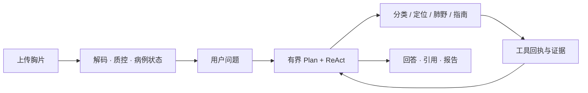

<div align="center">

# TBX-Agent

**把胸片工具、指南证据与可追溯对话连接起来**

本地部署的胸部 X 线分析研究原型 · 仅推理发布版


[快速体验](#快速体验) · [真实模型部署](docs/deployment/inference_models.md) · [架构](docs/architecture.md) · [API](docs/api.md)

</div>

> **使用边界**：用于研究与信息辅助，不用于确诊、排除肺结核、开具个体化处方或替代临床判断。软件测试通过不等于临床验证。

## 可以做什么

| 能力 | 使用方式 |
| --- | --- |
| 胸片分类 | 按需调用 ConvNeXt-Tiny，展示三分类结论；原始分数留在内部审计链路 |
| 候选区域定位 | 按需调用 D-FINE，区分有候选、无候选与技术失败 |
| 肺野空间分析 | PSPNet 肺野分割，描述左右肺及上、中、下二维区域；这些区域不是肺叶 |
| 指南问答 | 默认 BM25 检索，经来源、适用范围与审核元数据筛选，返回可追溯引用 |
| 对话与记录 | 有界工具调用、主动筛查问卷、病例记录、报告与结构化回执 |

上传只完成解码、去元数据、质量检查与病例建立。分析由用户问题触发；定位结果不会改写分类结果。
默认语言层是 **MedGemma 1.5 4B Q4_K_M + llama.cpp**，只接收工具产生的文本证据。
**MedSAM 默认关闭**，属于可选的轮廓可视化扩展。

## 工作方式



每步最多执行一个公开工具，也可以直接回答。能力说明、已完成分析摘要等由受信状态生成；
模型、工具或证据不可用时明确说明缺口。

## 快速体验

准备 **Python 3.11–3.13**，下载源码并在项目根目录打开终端。
Demo 使用标记为 `DEMO / MOCK` 的模拟视觉结果，**无需模型、数据集或 LLM 服务**。
首次安装 Python 依赖需要联网。

<details open>
<summary><b>Windows · PowerShell</b></summary>

```powershell
python -m venv .venv
& .\.venv\Scripts\python.exe -m pip install --upgrade pip
& .\.venv\Scripts\python.exe -m pip install -e ".[ui]"
& .\scripts\run_local.ps1 -Demo
```

</details>

<details>
<summary><b>Linux · Shell</b></summary>

```bash
python3 -m venv .venv
. .venv/bin/activate
python -m pip install --upgrade pip
python -m pip install -e ".[ui]"
sh scripts/run_local.sh --demo
```

</details>

打开 **[界面](http://127.0.0.1:8501)** 或 **[API 文档](http://127.0.0.1:8000/docs)**。
可以体验指南问答、问卷与模拟图像交互。只使用合成或已获授权且去标识的数据。

也可用 `scripts/bootstrap.ps1` 或 `sh scripts/bootstrap.sh` 创建环境并安装 UI、DICOM 依赖；
默认不会下载模型。环境变量和排障见 [快速部署](docs/deployment/quickstart.md)。

## 使用真实模型

此仓库不包含训练代码、数据集或权重。真实模式单独准备以下工件：

| 组件 | 获取方式 | 状态 |
| --- | --- | --- |
| 分类器 + 检测器 | 独立视觉推理 ZIP；校验清单与 SHA-256 | **公开下载链接待配置** |
| D-FINE 推理源码 | 固定上游源码，下载到外部目录 | 支持显式准备 |
| PSPNet 肺野模型 | TorchXRayVision 官方 Release | 支持显式下载与校验 |
| MedGemma + llama.cpp | 固定 GGUF 上游版本和运行时 | Windows 可自动准备；Linux 先构建并登记运行时 |
| Dense / Hybrid RAG | 自备固定 BGE-M3 快照与匹配索引 | 可选；默认 BM25 不需要 |
| MedSAM | 独立依赖与模型组 | 可选，默认关闭 |

视觉包 `tbx-rank03-inference-v1.zip` 为 **209.42 MiB**，SHA-256：

```text
0312172e649dffd774311db397066a916dc65845627aa1489049bfa36d971594
```

按 [真实模型部署](docs/deployment/inference_models.md) 完成“安装视觉包 → 准备 D-FINE / PSPNet →
准备 MedGemma → 预检启动”。该流程不要求训练。公开链接配置前，已有匹配模型包可安装，Demo 不受影响。

## 文档导航

| 想了解什么 | 文档 |
| --- | --- |
| 最短启动路径、环境与排障 | [快速部署](docs/deployment/quickstart.md) |
| 视觉包格式、安装与校验 | [真实模型部署](docs/deployment/inference_models.md) |
| MedGemma 与 Linux 运行时 | [语言模型部署](docs/deployment/medgemma_runtime.md) |
| 容器、挂载与网络 | [Docker](docs/deployment/docker.md) |
| 工具调度、病例状态与接口 | [架构](docs/architecture.md) · [API](docs/api.md) |
| 指南来源、索引与回执 | [RAG](docs/retrieval.md) · [知识摄取](docs/knowledge_ingestion.md) |
| 测试与能力限制 | [测试说明](docs/evaluation.md) · [安全边界](docs/safety_case.md) |
| 参与维护与发布 | [贡献指南](CONTRIBUTING.md) · [发布说明](docs/deployment/publishing.md) |

## 部署与许可边界

默认只监听本机。病例、上传文件、数据库、模型和密钥存放在仓库外；外部 LLM 服务会接收允许发送的
文本上下文，需由部署者配置和审查。当前为单进程部署，没有机构级高可用或经过验证的纵向影像比较。

项目代码的发布许可证尚待维护者确定；第三方代码、模型与指南各自的条款独立适用。
本仓库不授予未明确获得的模型再分发权限，详见 [第三方来源说明](THIRD_PARTY_NOTICES.md)。
