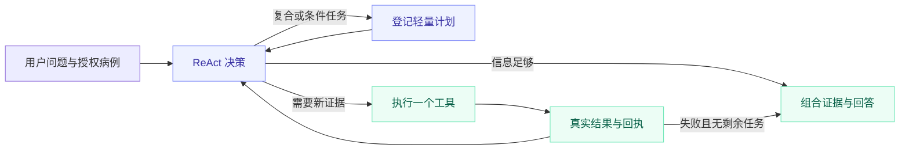

# 架构与工具链

TBX-Agent 将专用视觉模型、语言模型、指南检索和病例状态接入同一个对话入口。
视觉模型产生影像证据，LLM 选择当前动作，运行时负责执行与校验。

## 一次请求如何运行



主策略是 **ReAct 主循环 + 按需轻量计划 + 触发式恢复**。普通请求直接决策；复合或条件请求
才登记最多四项任务，计划节点不再额外调用规划模型。每次观察到工具结果后重新选择动作。
LangGraph `StateGraph` 负责执行图；业务记录存入 SQLite，原始短期对话保留在进程内。
没有持久化 checkpointer，也没有跨进程中间节点恢复。

## 模型与工具

| 公开工具 | 方法 | 输入与输出 |
| --- | --- | --- |
| `classify_cxr` | ConvNeXt-Tiny | 授权胸片 → 健康 / 非结核异常 / TB 三分类 |
| `localize_cxr` | D-FINE | 授权胸片 → 原图坐标候选框 |
| `analyze_lung_anatomy` | PSPNet 与空间关系计算 | 胸片及候选框 → 左右肺和上、中、下二维肺野位置 |
| `search_tb_knowledge` | BM25 或可选 Dense/Hybrid | 原始问题 → 来源经过校验的片段、回答与引用 |

上传阶段只解码、去元数据、检查基础输入质量并建立病例，不自动运行这些工具。
分类与定位独立保存；检测无候选框不会改写分类。当前肺野分割不是肺叶或病灶分割。

默认语言层为 MedGemma 1.5 4B Q4_K_M 与 llama.cpp，接收文本状态和工具证据；当前配置不把
原始胸片送给 LLM，图像由专用视觉后端处理。

## 语义动作与执行边界

模型通过严格 JSON Schema 选择语义任务，例如：

```json
{"tasks":[{"task":"locate_within_lungs","when":"always"}]}
```

代码把已选任务映射为工具、缓存读取或回答。模型不能指定病例 ID、租户、文件路径、执行参数，
不能改写实际送给知识检索器的原问题。规则意图解析仅在模型不可用或响应无效时兜底，并记录降级。
独立的否定执行检查只提供禁止集合，不负责添加肯定任务；它是有限句式检查，不是完备语义理解。

默认单轮上限为 5 次决策、4 次工具调用、3 次高成本视觉调用、10 单位工具成本。
所有路径都校验病例权限、输入输出契约、工具前置条件和预算。

## 多轮状态与缓存

`CaseRecord` 保存事实，运行时从中派生最小状态视图。同一 owner/user/thread 的请求使用进程内锁串行，
病例写入使用事务与版本比较；这不是分布式锁。缓存按图像、模型、预处理及配置身份判断有效性。

| 用户问题 | 已有证据 | 合同要求 |
| --- | --- | --- |
| “给这张片分类” | 尚未分析 | 运行分类 |
| “把可疑区域框出来” | 只有分类 | 运行定位 |
| “在肺野哪里” | 有框，没有肺野结果 | 运行肺野分析 |
| “再说一次位置” | 已有有效肺野结果 | 复用证据，不生成新执行回执 |
| “刚才成功了吗，别重跑” | 成功或失败记录 | 读取真实状态 |
| “仅异常才定位” | 分类为健康类 | 跳过条件分支 |

这些是执行合同，真实模型仍可能误判部分问法，实际结果见[测试说明](evaluation.md)。

## 回答与恢复

病例回答只组合已取得且本轮选中的证据，指南回答保留稳定引用。能力、状态、输入质量及缺少既往片
由真实状态投影；普通问答由 LLM 生成。分类解释可以说明该类别在三分类中最高，不能补造未输出的征象。
仅有检测框时描述图像坐标；取得有效肺野证据后可直接给出肺野位置，明确追问肺叶时再解释能力边界。

复合问题同时保留视觉结果、状态和适用的检索回答。工具失败产生失败回执，已成功的部分仍能返回。
只有可重试的容量饱和允许预算内重试一次。陈旧答案、遗漏显式任务或无效输出触发有界恢复；
不额外运行每轮必需的第二个评审 LLM，也没有跨任务 Reflexion 经验学习。

输出保护检查常见无回执执行声明、内部状态泄漏和无证据影像断言，但不能保证任意文本均无幻觉。
前端的成功/失败标签来自真实工具回执，计划只表示待办。

## 指南检索

默认检索为带元数据过滤的 BM25；BGE-M3 Dense 与 Hybrid/RRF 为可选配置，使用同一片段事实源。
可选本地向量索引需预先构建，索引绑定语料与模型身份。会话中没有在线网页搜索或后台自动重建索引。

工具内部解析问题范围、人群与场景，检查来源准入、适用性和片段身份。回答通过稳定片段 ID 关联出处
和支持文本；证据不足时报告缺口，不编造引用。工程 qrels 不是医学专家相关性金标准。

## 代码入口

| 文件 | 职责 |
| --- | --- |
| `src/tbx_agent/react_decision.py` | 语义动作协议与校验 |
| `src/tbx_agent/react_runtime.py` | ReAct 主循环、按需计划和回答组合 |
| `src/tbx_agent/langgraph_runtime.py` | 状态图与有界路由 |
| `src/tbx_agent/agent_runtime.py` | 执行回执、持久化及兼容设施 |
| `src/tbx_agent/tools/` | 工具注册与执行边界 |
| `src/tbx_agent/vision/` | 分类、检测、肺野推理 |
| `src/tbx_agent/retrieval/` | 检索与索引适配 |
| `src/tbx_agent/api/main.py` | FastAPI 入口 |
| `ui/streamlit_app.py` | 对话、图层、引用与病例界面 |

部署见[真实模型部署](deployment/inference_models.md)，接口见 [API](api.md)。
